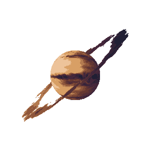

<h4 align="center"><samp> Hi there 👋🏾  welcome to my Github! I'm a Chaos Engineering Enthusiast, Open Source Contributor, and Professional Yak Shaver. I also like Python and I'm exploring Cloud Tech 🐍 ☁️ </samp></h4>

 
  

 <h3 align = "center"> 私 <samp>website</samp> 🧡</h3>

---

    
I have keys but no doors. I have space but no room. You can enter but can’t leave. What am I?

    A keyboard.

<var> sauce </var>
_sauce_
<time> gratatata </time>
 sauce 
<cite>sauce</cite>
<mark> gratatat </mark>
<dfn> a;lskdjf </dfn>

Do not forget to buy <mark>milk</mark> today.

#  sauce 

section sign

<tt> dig bop </tt> `tata`
<pre> ta;lkjt; </pre>
The <abbr title="World Health Organization">WHO</abbr> was founded in 1948.

<small> gratata me like </small>
<wbr>a;lskdjf</wbr>

---
pre tag nice for no copy but border styling
